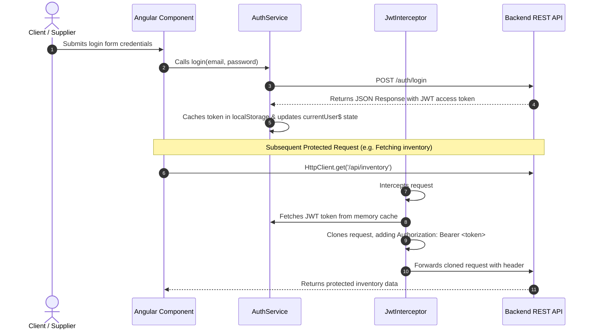
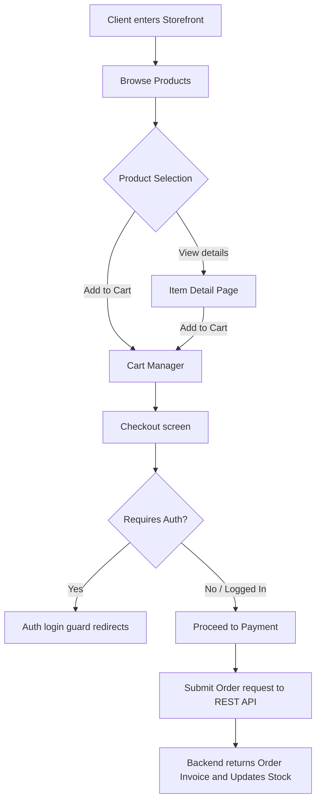
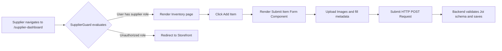

# M3allem E-commerce Architecture & Flow Guide

This document describes the architectural layout, system flows, and file organization of the **m3allem e-commerce storefront** and **supplier platform** frontend.

---

## 1. System Overview

**m3allem** is a service marketplace that features an integrated e-commerce system. The e-commerce section allows:
- **Clients/Workers**: Browse and purchase physical items (tools, spare parts, hardware materials).
- **Suppliers**: Manage inventory, upload new items, check stock levels, and review client order histories.

The client-side is built in Angular 17+ as a standalone, enterprise-ready SPA communicating with a remote REST API.

---

## 2. Directory Structure & Organization

The project employs a modular, domain-driven structure to support scalability and lazy loading.

```
src/app/
├── core/                           # SINGLETON ROOT MODULE
│   ├── core.module.ts              # Loads singleton services and configures interceptors
│   ├── guards/                     # Routing safety barriers
│   │   ├── auth.guard.ts           # Restricts access to authenticated users
│   │   └── supplier.guard.ts       # Restricts access specifically to "supplier" accounts
│   ├── interceptors/               # HTTP filters
│   │   └── jwt.interceptor.ts      # Appends jwt auth token to header of api requests
│   └── services/                   # Global, singleton services
│       ├── api.service.ts          # Central wrapper for HttpClient GET/POST/PUT/DELETE
│       └── auth.service.ts         # User authentication, token cache, and active session state
├── shared/                         # PRESENTATIONAL & REUSABLE MODULE
│   ├── shared.module.ts            # Declares and exports shared widgets
│   ├── components/                 # Atomic presentational components
│   │   ├── button/                 # Standard premium interactive buttons
│   │   ├── input/                  # Custom validated forms inputs
│   │   └── spinner/                # Premium loading indicator widgets
│   ├── pipes/                      # Custom pipes (e.g., currency formatting)
│   └── models/                     # Strict TypeScript interface contracts
│       ├── user.model.ts           # User profiles data model
│       └── item.model.ts           # E-commerce store item schema
└── features/                       # LAZY-LOADED DOMAINS
    ├── ecommerce/                  # PUBLIC STOREFRONT MODULE
    │   ├── ecommerce.module.ts
    │   ├── ecommerce-routing.module.ts
    │   ├── pages/
    │   │   ├── storefront/         # Store main listing catalog
    │   │   └── item-detail/        # Dedicated details and checkout view
    │   └── services/
    │       └── ecommerce.service.ts # Store product search, filtering, and ordering logic
    ├── supplier-dashboard/         # PROTECTED INVENTORY MODULE
    │   ├── supplier-dashboard.module.ts
    │   ├── supplier-dashboard-routing.module.ts
    │   ├── pages/
    │   │   ├── inventory/          # Supplier stock summary list
    │   │   └── submit-item/        # Add/edit product forms page
    │   └── services/
    │       └── inventory.service.ts # Inventory REST logic
    └── worker-portal/              # SERVICE WORKER MODULE
        ├── worker-portal.module.ts
        └── pages/
            ├── portal-home/        # Service dashboard, active tasks
            └── job-details/        # Direct contract agreements details page
```

---

## 3. Core Architectural Flows

### A. Authentication & Token injection Flow
Every REST request targeting protected resources requires a JWT authentication header.



---

### B. Storefront Purchase Flow
Clients browse and purchase tools/materials for service jobs.



---

### C. Supplier Inventory Management Flow
Protected portal where suppliers list products.



---

## 4. Architectural Interfaces & Contracts

### User Model (`src/app/shared/models/user.model.ts`)
Strict representation of authenticated accounts.
```typescript
export interface User {
  _id: string;
  name: string;
  email: string;
  role: 'client' | 'worker' | 'supplier' | 'admin';
  phone?: string;
  createdAt: string;
}
```

### Item Model (`src/app/shared/models/item.model.ts`)
Data model representing products in the supplier store.
```typescript
export interface Item {
  _id: string;
  supplierId: string;
  title: string;
  description: string;
  price: number;
  stockQuantity: number;
  category: string;
  imageUrl?: string;
  status: 'active' | 'out-of-stock' | 'draft';
  createdAt: string;
}
```
