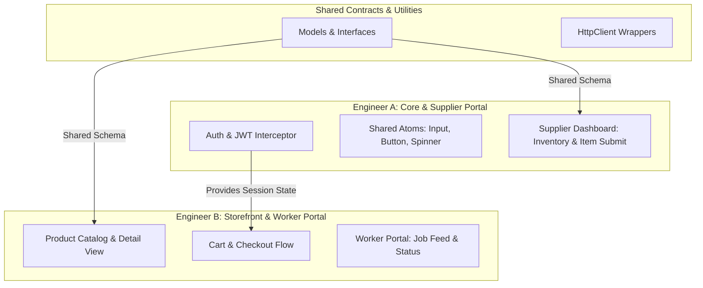

# M3allem E-commerce Development & Work Division Plan

This document outlines the division of the e-commerce and supplier platforms into two major work packages (Epics) for two engineers. By keeping the scopes large, we minimize management overhead and give each engineer full ownership of their respective domains.

To enable **parallel development** without blocking, both engineers will adhere to a **contract-first approach**, using the models and services defined in the shared directory as interface contracts and mocking API calls during the initial phases.

---

## High-Level Division of Labor

---

## Epic 1: Core Architecture, Shared Components, and Supplier Portal
**Owner:** Engineer A  
**Primary Focus:** Application foundation, security, global services, reusable presentation layer, and the supplier inventory management pages.

### 1. Directory & File Scope
Engineer A will own and work exclusively within these paths:
*   `src/app/core/`
    *   `core.module.ts` (Loads singletons, HTTP handlers)
    *   `guards/auth.guard.ts` (Ensures user authentication status)
    *   `guards/supplier.guard.ts` (Ensures user has `'supplier'` role)
    *   `interceptors/jwt.interceptor.ts` (Injects Bearer token to API requests)
    *   `services/api.service.ts` (Generic REST wrapper for `HttpClient`)
    *   `services/auth.service.ts` (Manages login, token caching, logout, and active user profile state)
*   `src/app/shared/`
    *   `shared.module.ts` (Imports/Exports atomic components)
    *   `components/button/` (Premium reusable button)
    *   `components/input/` (Standardized validated inputs)
    *   `components/spinner/` (Visual loading indicator)
    *   `models/user.model.ts` (Type interface for auth payload)
    *   `models/item.model.ts` (Type interface for inventory items)
*   `src/app/features/supplier-dashboard/`
    *   `supplier-dashboard.module.ts`
    *   `supplier-dashboard-routing.module.ts`
    *   `pages/inventory/` (List view showing stock levels, edit triggers)
    *   `pages/submit-item/` (Reactive forms for item additions and updates)
    *   `services/inventory.service.ts` (HTTP logic communicating with inventory endpoints)

### 2. Task Description
Implement the core setup (Angular Interceptors, API Wrapper, and Auth Guards) and construct a library of 3 reusable, presentational UI components (`app-button`, `app-input`, `app-spinner`). Leverage these foundation pieces to implement the Supplier Panel, allowing authorized supplier accounts to authenticate, view their current inventory table, and submit new items (or edit existing items) via a reactive form with real-time validation.

### 3. Azure DevOps Acceptance Criteria (BDD Format)

#### AC 1: Security & JWT Injection
*   **Given** an authenticated user with a valid JWT token stored in `localStorage`
*   **When** any HTTP REST API request is made through the `ApiService`
*   **Then** the request is intercepted by `JwtInterceptor` and the `Authorization: Bearer <token>` header is appended.
*   **Given** a user who is NOT authenticated or does NOT possess the `'supplier'` role
*   **When** they attempt to navigate directly to `/supplier-dashboard`
*   **Then** they are blocked by `SupplierGuard` and redirected back to `/ecommerce/storefront`.

#### AC 2: Shared Component Library
*   **Given** a developer implementing forms or views
*   **When** using `app-button`, `app-input`, or `app-spinner`
*   **Then** they render consistently with premium styling (hover micro-animations, loading states, error highlights) and enforce strict input validation.

#### AC 3: Supplier Inventory Management
*   **Given** an authenticated supplier logged into the portal
*   **When** they visit the `/supplier-dashboard/inventory` route
*   **Then** they see a responsive table/grid displaying all products associated with their `supplierId`, including columns for Title, Category, Price, Stock, and Status.
*   **When** the supplier clicks "Add Product" or "Edit" on a product row
*   **Then** they are presented with a form containing: Title (required), Description, Price (min: 0), Stock Quantity (min: 0), Category dropdown, and Image URL.
*   **When** they fill the fields and click "Submit"
*   **Then** the form performs client-side validation, shows a spinner during request execution, and sends a POST/PUT request to the backend. On success, the supplier is redirected back to the inventory list.

---

## Epic 2: Client Storefront, Shopping Cart, and Worker Portal
**Owner:** Engineer B  
**Primary Focus:** Public product catalog, detailed single-item view, shopping cart state management, checkout transaction flows, and the service worker dashboard.

### 1. Directory & File Scope
Engineer B will own and work exclusively within these paths:
*   `src/app/features/ecommerce/`
    *   `ecommerce.module.ts`
    *   `ecommerce-routing.module.ts`
    *   `pages/storefront/` (Product grid catalog, search bar, category filter widgets)
    *   `pages/item-detail/` (Detailed spec sheet, product images, "Add to Cart" checkout panel)
    *   `services/ecommerce.service.ts` (Fetches products, processes checkouts, and handles local cart array)
*   `src/app/features/worker-portal/`
    *   `worker-portal.module.ts`
    *   `pages/portal-home/` (Dashboard for service workers listing available and active tasks)
    *   `pages/job-details/` (Full breakdown of service contract details and actions)

### 2. Task Description
Develop the customer-facing storefront where clients browse spare parts, tools, and hardware materials. This includes a product catalog page with instant text search and category filtering, a product detail view, and a reactive shopping cart widget. Create a checkout form to place orders. Additionally, develop the Worker Portal layout so that field service technicians can log in, view their assigned repair/maintenance jobs, and examine contract details.

### 3. Azure DevOps Acceptance Criteria (BDD Format)

#### AC 1: Product Search & Filter Catalog
*   **Given** a user visiting the homepage `/ecommerce/storefront`
*   **When** they type a search query in the search input or select a category
*   **Then** the displayed item catalog updates dynamically to show matching items without reloading the page.
*   **When** they click on any product card
*   **Then** they are routed to `/ecommerce/item-detail/:id`, showing comprehensive description, stock availability badge, and pricing.

#### AC 2: Shopping Cart & Checkout
*   **Given** a user browsing the catalog or item detail page
*   **When** they click "Add to Cart"
*   **Then** the item is added to the cart, the quantity badge in the navbar updates, and a flyout cart drawer displays the summary.
*   **Given** items in the cart
*   **When** the user proceeds to checkout and submits the checkout form
*   **Then** the application calls the order creation endpoint, clears the cart upon a successful response, and displays an order invoice receipt confirmation modal.

#### AC 3: Worker Portal Dashboard
*   **Given** an authenticated user with the role of `'worker'`
*   **When** they navigate to `/worker-portal/portal-home`
*   **Then** they see their dashboard showing two columns: "Available Gigs" and "My Active Contracts".
*   **When** they click "View Contract"
*   **Then** they are navigated to `/worker-portal/job-details/:id` to inspect task checklists, customer details, and update job status (e.g., mark as "In Progress" or "Completed").

---

## Integration Plan & Branching Strategy

To avoid dependencies blocking development:
1.  **Shared Interface Mocking:** Engineer B will initially consume mock data (JSON arrays matching `Item` and `User` models) inside `ecommerce.service.ts` while Engineer A finishes `auth.service.ts` and `api.service.ts`.
2.  **Git Branching:**
    *   Branch from `main` into `feature/epic-core-supplier` (Engineer A) and `feature/epic-storefront-worker` (Engineer B).
    *   Once Engineer A merges the core architecture (`api.service.ts` and shared models), Engineer B will rebase or merge `main` into their branch to replace mock data with active services.
3.  **PR Checklists for DevOps Pipelines:**
    *   Both branches must compile with `ng build` and pass unit tests with `ng test` (Vitest) before PR approval.
